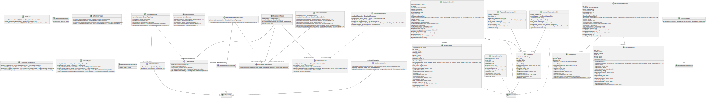

# Arquitecturas Web - Integrador N°3
Arquitecturas Web - Integrador N°3 (Springboot)

# Integrantes:
- Juan Schwindt
- Facundo Sanchez
- Jeremías Staldeker

# Diagrama de Clases:

# Testing:
Se incluyó una colección de `Postman` con todos los endpoints requeridos en el trabajo; la misma se encuentra en la carpeta `"recursos/TPE-3 Arquitectura.postman_collection.json"`.

Por defecto, cuenta con la variable `gateway` con el valor `"http://localhost:8080"`, que debería ser el gateway hacia nuestra API."

# Aclaraciones:
El desarrollo del integrador se realizó en base a Java 11.

Se decidió utilizar una base de datos `MySQL` alojada en un servidor externo, por lo que la base de datos ya está actualmente poblada. 

En caso de desear probar la creación de tablas e inserción de datos desde CSV, deberán eliminarse dichas tablas o cambiar las credenciales presentes en el archivo `"src/main/resources/application.properties"` para que apunten a una nueva base de datos y descomentar el bloque de código dentro de la función `insertData()` contenida en `DatabaseInitializer.java` .
